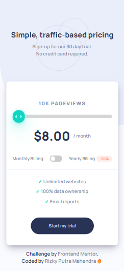
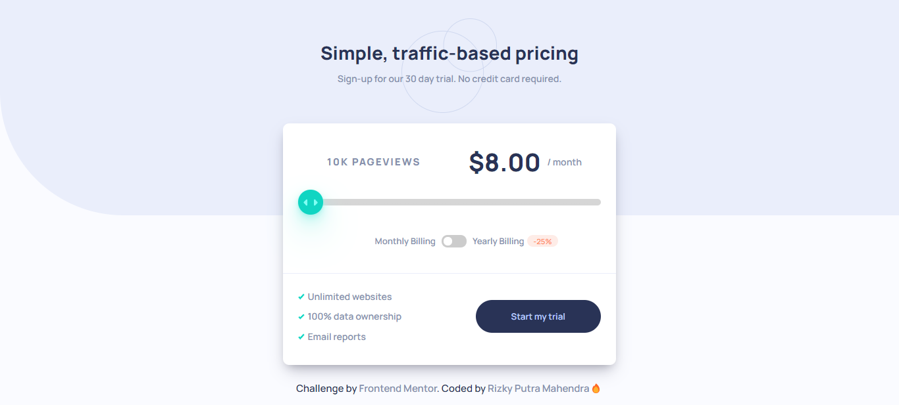

# Frontend Mentor - Interactive pricing component solution

This is a solution to the [Interactive pricing component challenge on Frontend Mentor](https://www.frontendmentor.io/challenges/interactive-pricing-component-t0m8PIyY8). Frontend Mentor challenges help you improve your coding skills by building realistic projects.

## Table of contents

-   [Overview](#overview)
    -   [The challenge](#the-challenge)
    -   [Screenshot](#screenshot)
    -   [Links](#links)
-   [My process](#my-process)
    -   [Built with](#built-with)
    -   [Useful resources](#useful-resources)
-   [Author](#author)

**Note: Delete this note and update the table of contents based on what sections you keep.**

## Overview

### The challenge

Users should be able to:

-   View the optimal layout for the app depending on their device's screen size
-   See hover states for all interactive elements on the page
-   Use the slider and toggle to see prices for different page view numbers

### Screenshot

### Links

-   Solution URL: [Github](https://github.com/rizky-pm/interactive-pricing-component)
-   Live Site URL: [Github Pages](https://rizky-pm.github.io/interactive-pricing-component/)

## My process

### Built with

-   Semantic HTML5 markup
-   CSS custom properties
-   Flexbox
-   CSS Grid
-   Mobile-first workflow
-   [jQuery](https://jquery.com/) - For manipulating DOM
-   [React](https://reactjs.org/) - JS library
-   [Styled Components](https://styled-components.com/) - For styles

### Useful resources

-   [Custom Range Slider using HTML CSS & Javascript by Coding Nepal](https://www.youtube.com/watch?v=5bmDoibhKZw)
-   [How To Create a Toggle Switch - W3Schools](https://www.w3schools.com/howto/howto_css_switch.asp)

## Author

-   Frontend Mentor - [@rizky-pm](https://www.frontendmentor.io/profile/rizky-pm)
-   Twitter - [@\_rizkypm](https://twitter.com/_rizkypm)
